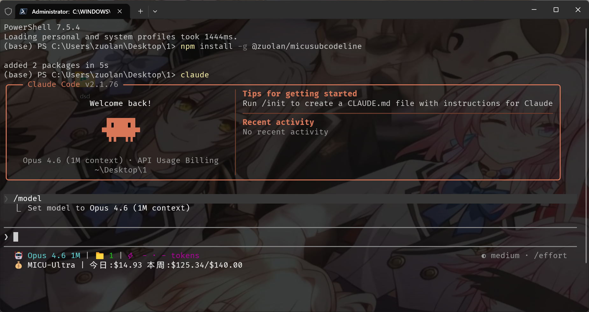

# MicuSubCodeLine

[English](README.md) | [中文](README.zh.md)

A high-performance Claude Code statusline tool written in Rust with Git integration, usage tracking, interactive TUI configuration, Sub2API subscription display, and Claude Code enhancement utilities.


## Screenshots



The statusline shows: Model | Directory | Git Branch Status | Context Window | Subscription Info

## Features

### Core Functionality
- **Git integration** with branch, status, and tracking info
- **Model display** with simplified Claude model names
- **Usage tracking** based on transcript analysis
- **Directory display** showing current workspace
- **Subscription display** real-time Sub2API subscription info (auto-reads API Key from Claude Code settings, zero config)
- **Minimal design** using Nerd Font icons

### Interactive TUI Features
- **Interactive main menu** when executed without input
- **TUI configuration interface** with real-time preview
- **Theme system** with multiple built-in presets
- **Segment customization** with granular control
- **Configuration management** (init, check, edit)

### Claude Code Enhancement
- **Context warning disabler** - Remove annoying "Context low" messages
- **Verbose mode enabler** - Enhanced output detail
- **Robust patcher** - Survives Claude Code version updates
- **Automatic backups** - Safe modification with easy recovery

## Installation

### Download Pre-built Binary

Download from [Releases](https://github.com/zuoliangyu/MicuSubCodeLine/releases):

#### Linux (Dynamic)
```bash
mkdir -p ~/.claude/micusubcodeline
wget https://github.com/zuoliangyu/MicuSubCodeLine/releases/latest/download/micusubcodeline-linux-x64.tar.gz
tar -xzf micusubcodeline-linux-x64.tar.gz
cp micusubcodeline ~/.claude/micusubcodeline/
chmod +x ~/.claude/micusubcodeline/micusubcodeline
```
*Requires: Ubuntu 22.04+, CentOS 9+, Debian 11+, RHEL 9+ (glibc 2.35+)*

#### Linux (Static)
```bash
mkdir -p ~/.claude/micusubcodeline
wget https://github.com/zuoliangyu/MicuSubCodeLine/releases/latest/download/micusubcodeline-linux-x64-static.tar.gz
tar -xzf micusubcodeline-linux-x64-static.tar.gz
cp micusubcodeline ~/.claude/micusubcodeline/
chmod +x ~/.claude/micusubcodeline/micusubcodeline
```
*Works on any Linux distribution (static, no dependencies)*

#### macOS (Intel)
```bash
mkdir -p ~/.claude/micusubcodeline
wget https://github.com/zuoliangyu/MicuSubCodeLine/releases/latest/download/micusubcodeline-macos-x64.tar.gz
tar -xzf micusubcodeline-macos-x64.tar.gz
cp micusubcodeline ~/.claude/micusubcodeline/
chmod +x ~/.claude/micusubcodeline/micusubcodeline
```

#### macOS (Apple Silicon)
```bash
mkdir -p ~/.claude/micusubcodeline
wget https://github.com/zuoliangyu/MicuSubCodeLine/releases/latest/download/micusubcodeline-macos-arm64.tar.gz
tar -xzf micusubcodeline-macos-arm64.tar.gz
cp micusubcodeline ~/.claude/micusubcodeline/
chmod +x ~/.claude/micusubcodeline/micusubcodeline
```

#### Windows
```powershell
New-Item -ItemType Directory -Force -Path "$env:USERPROFILE\.claude\micusubcodeline"
Invoke-WebRequest -Uri "https://github.com/zuoliangyu/MicuSubCodeLine/releases/latest/download/micusubcodeline-windows-x64.zip" -OutFile "micusubcodeline-windows-x64.zip"
Expand-Archive -Path "micusubcodeline-windows-x64.zip" -DestinationPath "."
Move-Item "micusubcodeline.exe" "$env:USERPROFILE\.claude\micusubcodeline\"
```

### Build from Source

```bash
git clone https://github.com/zuoliangyu/MicuSubCodeLine.git
cd MicuSubCodeLine
cargo build --release

# Linux/macOS
mkdir -p ~/.claude/micusubcodeline
cp target/release/micusubcodeline ~/.claude/micusubcodeline/
chmod +x ~/.claude/micusubcodeline/micusubcodeline

# Windows (PowerShell)
New-Item -ItemType Directory -Force -Path "$env:USERPROFILE\.claude\micusubcodeline"
copy target\release\micusubcodeline.exe "$env:USERPROFILE\.claude\micusubcodeline\"
```

### Claude Code Configuration

Add to your Claude Code `settings.json`:

**Linux/macOS:**
```json
{
  "statusLine": {
    "type": "command",
    "command": "~/.claude/micusubcodeline/micusubcodeline",
    "padding": 0
  }
}
```

**Windows:**
```json
{
  "statusLine": {
    "type": "command",
    "command": "%USERPROFILE%\\.claude\\micusubcodeline\\micusubcodeline.exe",
    "padding": 0
  }
}
```

## Usage

### Subscription Info (Zero Config)

The subscription segment automatically reads your API Key from Claude Code's settings — no manual configuration needed.

Reading priority:
1. `~/.claude/settings.local.json` → `env.ANTHROPIC_API_KEY` / `ANTHROPIC_AUTH_TOKEN`
2. `~/.claude/settings.json` → `env.ANTHROPIC_API_KEY` / `ANTHROPIC_AUTH_TOKEN`
3. Environment variable `ANTHROPIC_API_KEY` / `ANTHROPIC_AUTH_TOKEN`
4. `~/.claude/micusubcodeline/subscription_config.txt` (legacy fallback)

```bash
# Check API Key detection status
micusubcodeline --init-subscription
```

### Configuration Management

```bash
# Initialize configuration file
micusubcodeline --init

# Check configuration validity
micusubcodeline --check

# Print current configuration
micusubcodeline --print

# Enter TUI configuration mode
micusubcodeline --config
```

### Theme Override

```bash
# Temporarily use specific theme (overrides config file)
micusubcodeline --theme cometix
micusubcodeline --theme minimal
micusubcodeline --theme gruvbox
micusubcodeline --theme nord
micusubcodeline --theme powerline-dark

# Or use custom theme files from ~/.claude/micusubcodeline/themes/
micusubcodeline --theme my-custom-theme
```

### Claude Code Enhancement

```bash
# Disable context warnings and enable verbose mode
micusubcodeline --patch /path/to/claude-code/cli.js
```

## Default Segments

Displays: `Directory | Git Branch Status | Model | Context Window`

### Git Status Indicators

- Branch name with Nerd Font icon
- Status: `✓` Clean, `●` Dirty, `⚠` Conflicts
- Remote tracking: `↑n` Ahead, `↓n` Behind

### Model Display

Shows simplified Claude model names:
- `claude-3-5-sonnet` → `Sonnet 3.5`
- `claude-4-sonnet` → `Sonnet 4`

### Context Window Display

Token usage percentage based on transcript analysis with context limit tracking.

## Configuration

MicuSubCodeLine supports full configuration via TOML files and interactive TUI:

- **Configuration file**: `~/.claude/micusubcodeline/config.toml`
- **Interactive TUI**: `micusubcodeline --config` for real-time editing with preview
- **Theme files**: `~/.claude/micusubcodeline/themes/*.toml` for custom themes
- **Automatic initialization**: `micusubcodeline --init` creates default configuration

### Available Segments

All segments are configurable with:
- Enable/disable toggle
- Custom separators and icons
- Color customization
- Format options

Supported segments: Directory, Git, Model, Usage, Time, Cost, OutputStyle, Subscription

## Requirements

- **Git**: Version 1.5+ (Git 2.22+ recommended for better branch detection)
- **Terminal**: Must support Nerd Fonts for proper icon display
  - Install a [Nerd Font](https://www.nerdfonts.com/) (e.g., FiraCode Nerd Font, JetBrains Mono Nerd Font)
  - Configure your terminal to use the Nerd Font
- **Claude Code**: For statusline integration

## Development

```bash
# Build development version
cargo build

# Run tests
cargo test

# Build optimized release
cargo build --release
```

## Contributing

Contributions are welcome! Please feel free to submit issues or pull requests.

## License

This project is licensed under the [MIT License](LICENSE).
