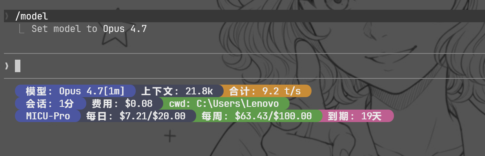

# MicuSubCodeLine

[English](README.en.md) | [中文](README.md)

基于 Rust 的高性能 Claude Code 状态栏工具，集成 Git 信息、使用量跟踪、Sub2API 订阅信息显示和 Claude Code 补丁工具。


> ⚠️ **v2.0.0 重大变更（破坏性）**：状态栏现在渲染**固定锁死的 3 行布局**，**无法**通过任何配置文件、主题文件、`--theme` 参数或 TUI 编辑改动。订阅数据来自 **`https://sub.micuapi.ai`**。如果你在 v1.x 依赖自定义 `config.toml`/主题，升级后这些将不再作用于状态栏渲染。

## 截图



锁定的状态栏固定渲染三行：

- **第 1 行** — `模型` · `上下文` · `⌥ 分支` · `(+N,−N)` Git 变更 · `合计`（吞吐 t/s）
- **第 2 行** — `会话` · `费用` · `cwd` 当前工作目录
- **第 3 行** — 套餐名 · `每日`（$已用/$限额）· `每周`（$已用/$限额）· `到期`（剩余天数）
  - 非订阅用户（钱包余额模式）则改为：套餐名 · `今日`（$已用）· `余额`（$剩余）

## 特性

### 核心功能
- **固定锁定布局** — 像素稳定的 3 行 powerline 输出，用户不可改
- **Git 集成** 显示分支与工作区改动行数
- **模型显示** 简化的 Claude 模型名称
- **上下文 / 吞吐** 基于转录文件分析（token、t/s）
- **订阅信息** 实时显示来自 `https://sub.micuapi.ai` 的 Sub2API 订阅状态（自动读取 Claude Code 配置中的 API Key，无需手动配置）

### Claude Code 增强
- **禁用上下文警告** 移除烦人的“Context low”消息
- **启用详细模式** 增强输出详细信息
- **稳定补丁器** 适应 Claude Code 版本更新
- **自动备份** 安全修改，支持轻松恢复

## 安装

### 下载预编译二进制

从 [Releases](https://github.com/zuoliangyu/MicuSubCodeLine/releases) 下载：

#### Linux（动态链接版本）
```bash
mkdir -p ~/.claude/micusubcodeline
wget https://github.com/zuoliangyu/MicuSubCodeLine/releases/latest/download/micusubcodeline-linux-x64.tar.gz
tar -xzf micusubcodeline-linux-x64.tar.gz
cp micusubcodeline ~/.claude/micusubcodeline/
chmod +x ~/.claude/micusubcodeline/micusubcodeline
```
*系统要求: Ubuntu 22.04+, CentOS 9+, Debian 11+, RHEL 9+ (glibc 2.35+)*

#### Linux（静态链接版本）
```bash
mkdir -p ~/.claude/micusubcodeline
wget https://github.com/zuoliangyu/MicuSubCodeLine/releases/latest/download/micusubcodeline-linux-x64-static.tar.gz
tar -xzf micusubcodeline-linux-x64-static.tar.gz
cp micusubcodeline ~/.claude/micusubcodeline/
chmod +x ~/.claude/micusubcodeline/micusubcodeline
```
*适用于任何 Linux 发行版（静态链接，无依赖）*

#### macOS (Intel)
```bash
mkdir -p ~/.claude/micusubcodeline
wget https://github.com/zuoliangyu/MicuSubCodeLine/releases/latest/download/micusubcodeline-macos-x64.tar.gz
tar -xzf micusubcodeline-macos-x64.tar.gz
cp micusubcodeline ~/.claude/micusubcodeline/
chmod +x ~/.claude/micusubcodeline/micusubcodeline
```

#### macOS (Apple Silicon)
```bash
mkdir -p ~/.claude/micusubcodeline
wget https://github.com/zuoliangyu/MicuSubCodeLine/releases/latest/download/micusubcodeline-macos-arm64.tar.gz
tar -xzf micusubcodeline-macos-arm64.tar.gz
cp micusubcodeline ~/.claude/micusubcodeline/
chmod +x ~/.claude/micusubcodeline/micusubcodeline
```

#### Windows
```powershell
New-Item -ItemType Directory -Force -Path "$env:USERPROFILE\.claude\micusubcodeline"
Invoke-WebRequest -Uri "https://github.com/zuoliangyu/MicuSubCodeLine/releases/latest/download/micusubcodeline-windows-x64.zip" -OutFile "micusubcodeline-windows-x64.zip"
Expand-Archive -Path "micusubcodeline-windows-x64.zip" -DestinationPath "."
Move-Item "micusubcodeline.exe" "$env:USERPROFILE\.claude\micusubcodeline\"
```

### 从源码构建

```bash
git clone https://github.com/zuoliangyu/MicuSubCodeLine.git
cd MicuSubCodeLine
cargo build --release

# Linux/macOS
mkdir -p ~/.claude/micusubcodeline
cp target/release/micusubcodeline ~/.claude/micusubcodeline/
chmod +x ~/.claude/micusubcodeline/micusubcodeline

# Windows (PowerShell)
New-Item -ItemType Directory -Force -Path "$env:USERPROFILE\.claude\micusubcodeline"
copy target\release\micusubcodeline.exe "$env:USERPROFILE\.claude\micusubcodeline\"
```

### Claude Code 配置

添加到 Claude Code `settings.json`：

**Linux/macOS:**
```json
{
  "statusLine": {
    "type": "command",
    "command": "~/.claude/micusubcodeline/micusubcodeline",
    "padding": 0
  }
}
```

**Windows:**
```json
{
  "statusLine": {
    "type": "command",
    "command": "%USERPROFILE%\\.claude\\micusubcodeline\\micusubcodeline.exe",
    "padding": 0
  }
}
```

## 使用

### 订阅信息（即下即用）

订阅行会自动从 Claude Code 的配置中读取 API Key，无需手动配置。数据请求自 `https://sub.micuapi.ai/v1/usage`。

读取优先级：
1. `~/.claude/settings.local.json` → `env.ANTHROPIC_API_KEY` / `ANTHROPIC_AUTH_TOKEN`
2. `~/.claude/settings.json` → `env.ANTHROPIC_API_KEY` / `ANTHROPIC_AUTH_TOKEN`
3. 环境变量 `ANTHROPIC_API_KEY` / `ANTHROPIC_AUTH_TOKEN`
4. `~/.claude/micusubcodeline/subscription_config.txt`（旧版兼容）

```bash
# 检测 API Key 状态
micusubcodeline --init-subscription
```

### Claude Code 增强

```bash
# 禁用上下文警告并启用详细模式
micusubcodeline --patch /path/to/claude-code/cli.js
```

### 旧命令（对锁定状态栏无效）

自 v2.0.0 起状态栏已被硬锁。以下命令仍保留以兼容旧版，但**不会改变显示的状态栏**：

```bash
micusubcodeline --init      # 写入的 config.toml 在渲染时被忽略
micusubcodeline --check     # 校验（被忽略的）配置文件
micusubcodeline --print     # 打印（被忽略的）配置
micusubcodeline --config    # 打开 TUI，但编辑不会作用于输出
micusubcodeline --theme X   # 主题覆盖不会作用于输出
```

## 系统要求

- **Git**: 版本 1.5+ (推荐 Git 2.22+ 以获得更好的分支检测)
- **终端**: 必须支持 Nerd Font 图标/powerline 正常显示
  - 安装 [Nerd Font](https://www.nerdfonts.com/) 字体
  - 中文用户推荐: [Maple Font](https://github.com/subframe7536/maple-font) (支持中文的 Nerd Font)
  - 在终端中配置使用该字体
- **Claude Code**: 用于状态栏集成

## 开发

```bash
# 构建开发版本
cargo build

# 运行测试
cargo test

# 构建优化版本
cargo build --release
```

## 贡献

欢迎贡献！请随时提交 issue 或 pull request。

## 许可证

本项目采用 [MIT 许可证](LICENSE)。
